# MILESTONE 1 IF3110 2024/2025

## Web Application Description
LockedIn is a web-based platform designed to assist job seekers and companies in the recruitment process. Job seekers can search for job listings, apply for relevant positions, and track their application history. Companies can post job openings, manage incoming applications, and make decisions regarding applications. This application is designed with core functionalities to support an efficient and transparent recruitment system.

## Requirements
- PHP (Minimum version: 7.4)
- PostgreSQL/MySQL/MariaDB (for database management)
- Docker (to run the application)
- Quill.js (for rich text editor functionality)
- Pure JavaScript, HTML, CSS (no frameworks like jQuery, Bootstrap, etc.)

## Installation Instructions
1. Install requirements

   - Untuk windows and mac user

     - Download docker desktop [here](https://www.docker.com/products/docker-desktop/)

   - Untuk UNIX like user jalankan command di bawah

   ```sh
    sudo apt-get update
    sudo apt-get install docker-ce docker-ce-cli containerd.io docker-compose-plugin
   ```

2. Clone this repository:
```bash
git clone https://github.com/Labpro-21/if3110-tubes-2024-k02-05.git
```

## How to run the server

1. Make .env file on root

2. Copy the .env.example file into .env file

3. Run the docker:
   ```bash
   docker compose build
   docker compose up
   ```
4. If this is your first time running, make a database migrations :
   ```bash
   docker exec -it php-apache php  setup/run_migrations.php
   ```

4. Migrate database (Only for Initialize)
```bash
docker exec -it php-apache php  setup/run_migrations.php
```

5. Seeding data (if needed)
```bash
docker exec -it php-apache php  database/migrations/seeding.php
```

6. Open the browser http://localhost:8000

## UI Page
### Login Page
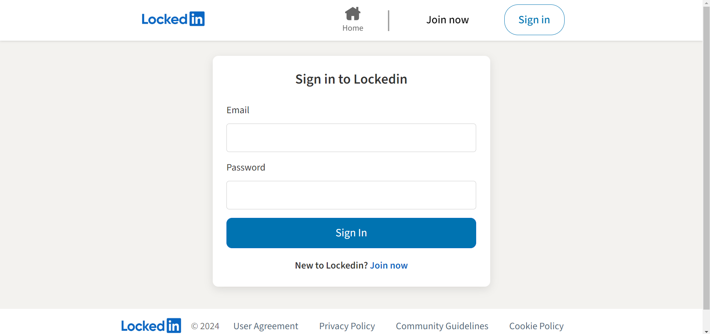
### Register Page
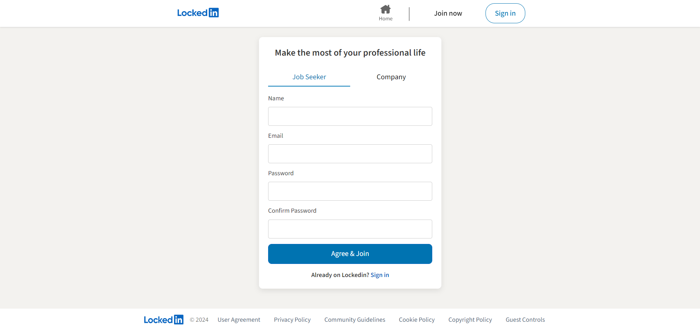
### Home Page (Job Seeker)
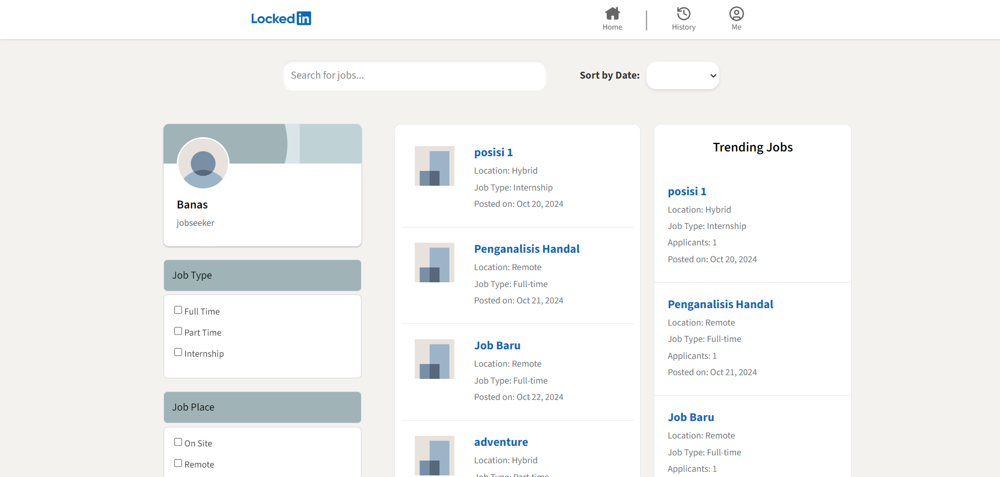
### Home Page (Company)
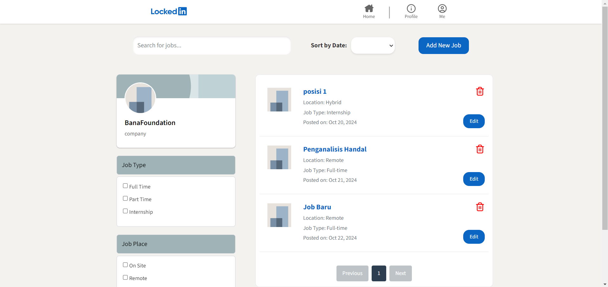
### TambahLowongan Page (Company)
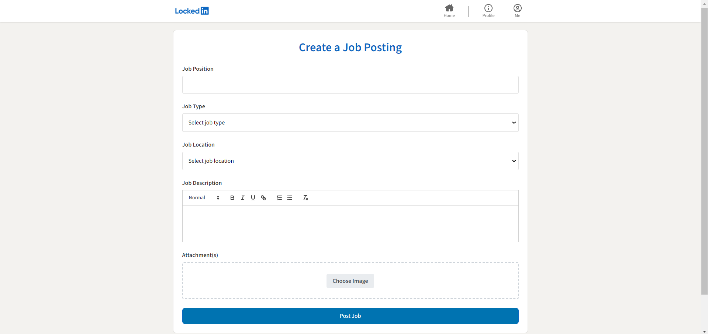
### DetailLowongan Page (Company)
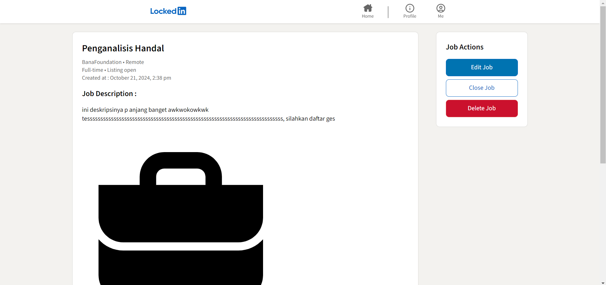
### DetailLamaran Page (Company)
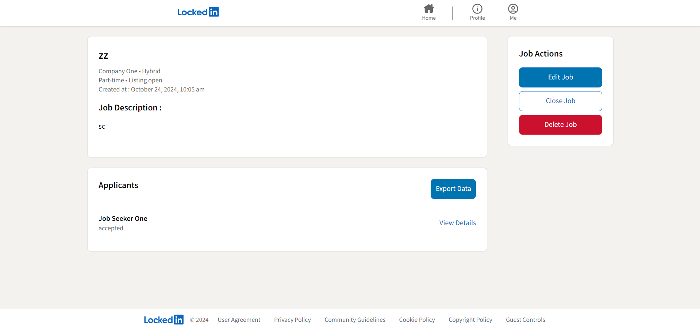
### EditLowongan Page (Company)
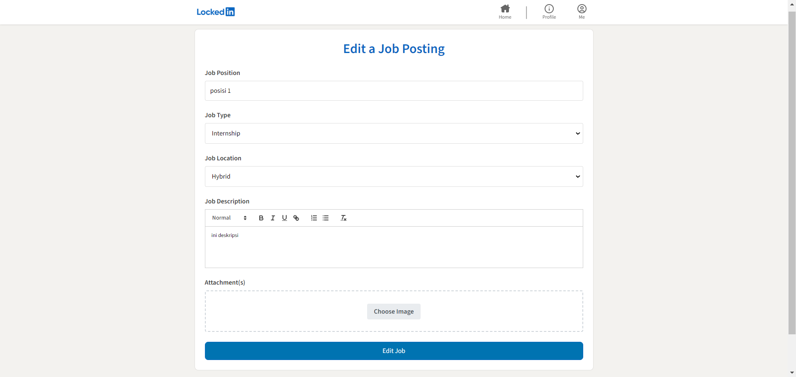
### DetailLowongan Page (Job Seeker)
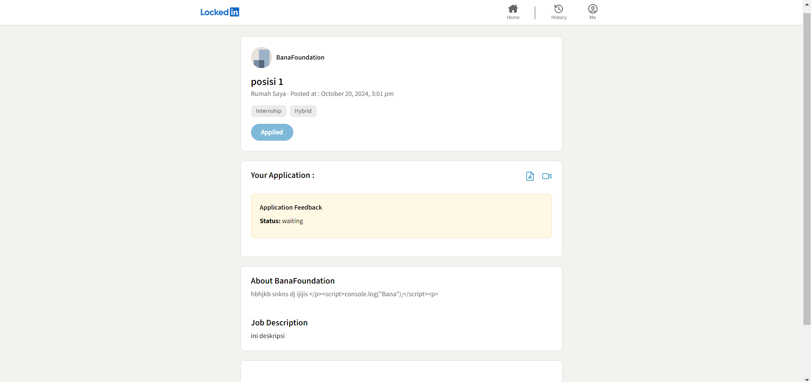
### Lamaran Page (Job Seeker)
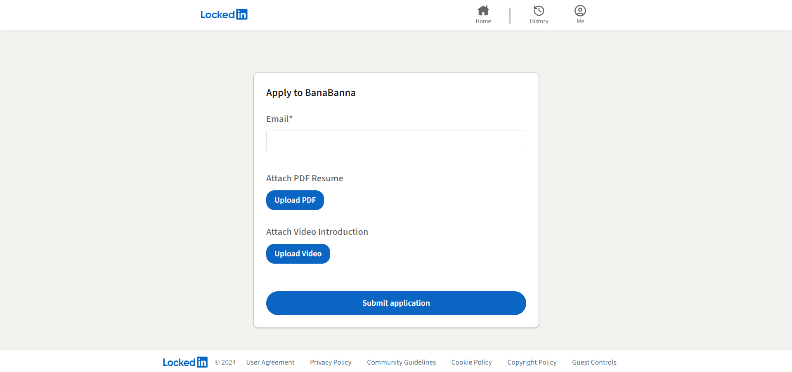
### Riwayat Page (Job Seeker)
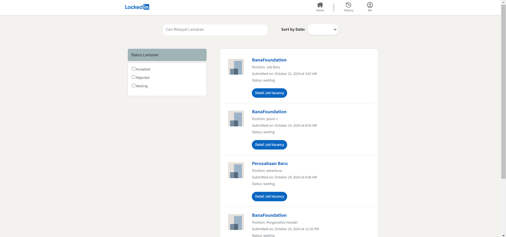
### Profil Page (Company)
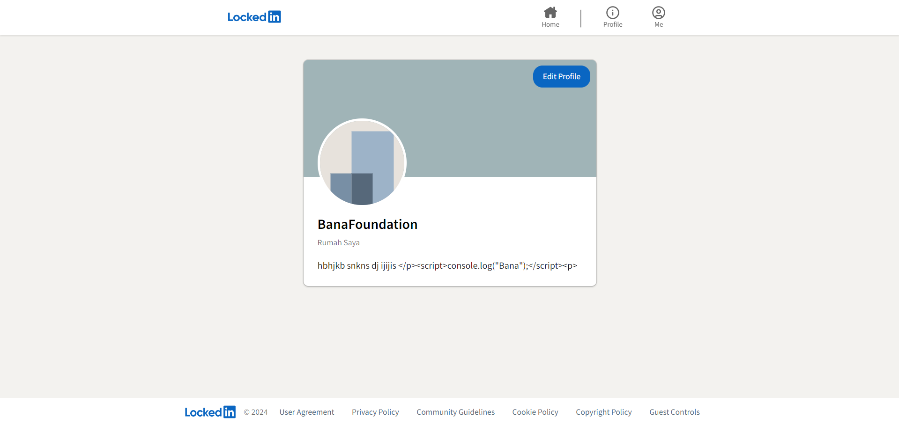

## Lighthouse
### Login Page
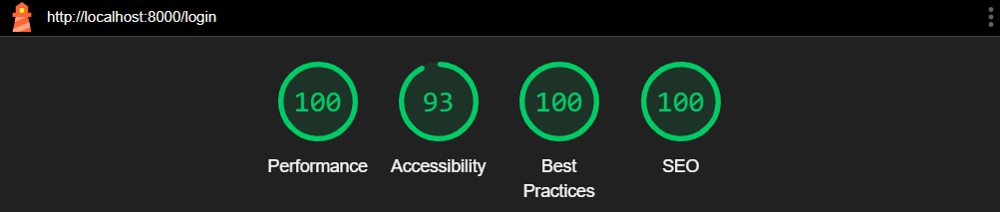
### Register Page
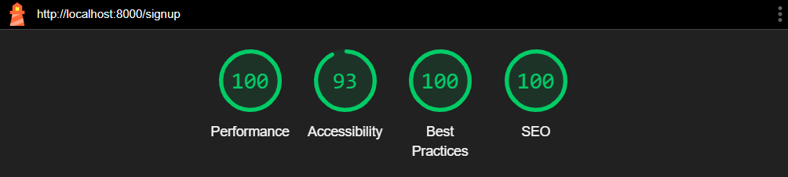
### Home Page (Job Seeker)
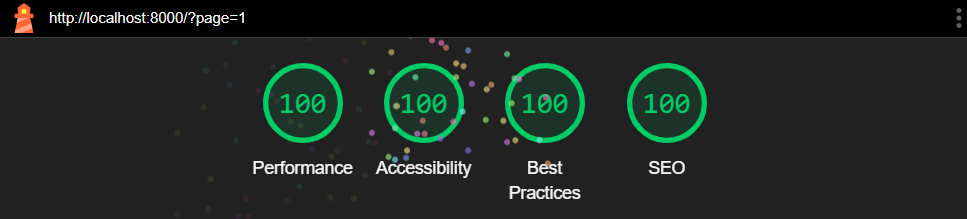
### Home Page (Company)
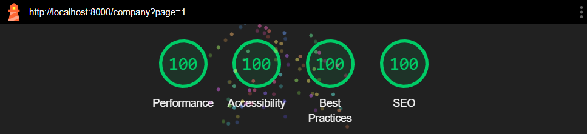
### TambahLowongan Page (Company)
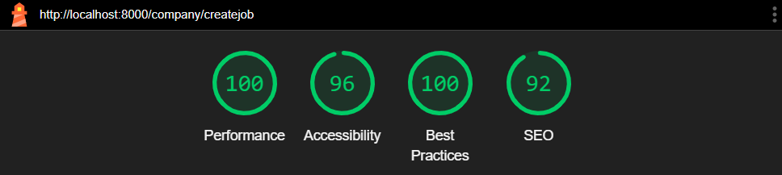
### DetailLowongan Page (Company)
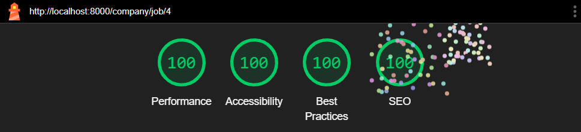
### DetailLamaran Page (Company)
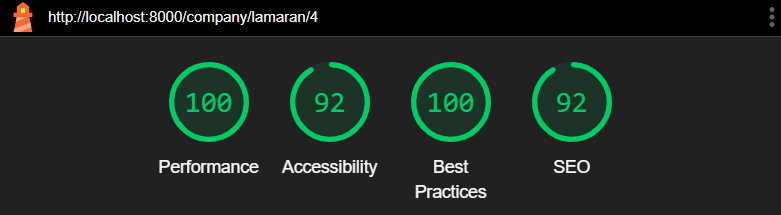
### EditLowongan Page (Company)
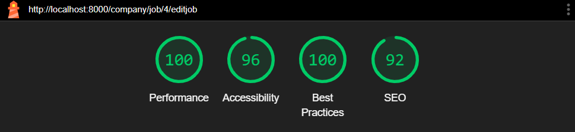
### DetailLowongan Page (Job Seeker)
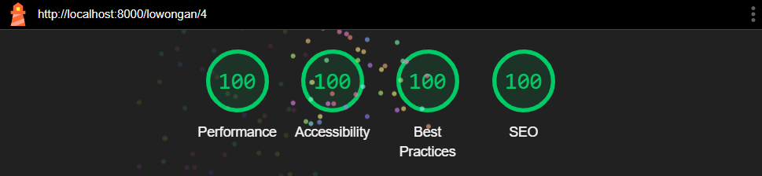
### Lamaran Page (Job Seeker)
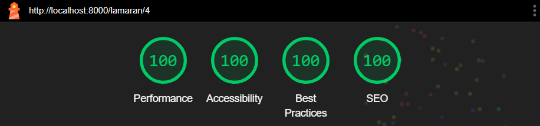
### Riwayat Page (Job Seeker)
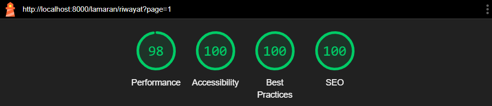
### Profil Page (Company)
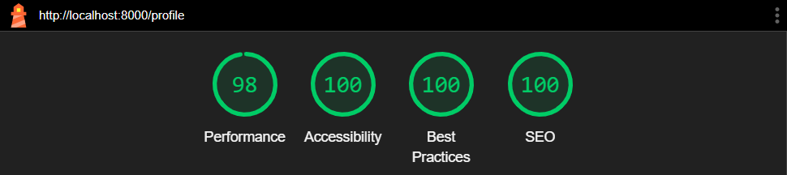

## Task Distribution
| Name | Student-ID | Client-side | Server-side |
|--------------------------|------------|-------------|-------------|
| Gregorius Moses Marevson | 13520052 | <ul> <li> Profile Page </ul> | <ul> <li> Profile Page </ul> |
| Ahmad Hasan Albana | 13522041 | <ul> <li> Halaman Detail Lowongan (Job Seeker) <li> Halaman Lamaran (Job Seeker) <li> Halaman Riwayat (Job Seeker) </ul> | <ul> <li> Halaman Detail Lowongan (Job Seeker) <li> Halaman Lamaran (Job Seeker) <li> Halaman Riwayat (Job Seeker) </ul> |
| Rayhan Fadhlan | 13522095 | <ul> <li> Halaman Login <li> Halaman Tambah Lowongan (Company) <li> Halaman Detail Lowongan (Company) <li> Halaman Detail Lamaran (Company) <li> Bonus 3 </ul> | <ul> <li> Halaman Login <li> Halaman Tambah Lowongan (Company) <li> Halaman Detail Lowongan (Company) <li> Halaman Detail Lamaran (Company) <li> Bonus 3 </ul> |
| William Glory Henderson | 13522113 | <ul> <li> Halaman Register <li> Halaman Home (Job Seeker) <li> Halaman Home (Company) <li> Halaman Edit Lowongan (Company) <li> Bonus 4 </ul> | <ul> <li> Halaman Register <li> Halaman Home (Job Seeker) <li> Halaman Home (Company) <li> Halaman Edit Lowongan (Company) <li> Bonus 4 </ul> |

## Features
| Feature | Implement |
| -----------------------------------------  | ------------------------- |
| Halaman Login | Done 
| Halaman Register | Done 
| Halaman Home (Job Seeker) | Done 
| Halaman Home (Company) | Done 
| Halaman Tambah Lowongan (Company) | Done 
| Halaman Detail Lowongan (Company) | Done 
| Halaman Detail Lamaran (Company) | Done 
| Halaman Edit Lowongan (Company) | Done 
| Halaman Detail Lowongan (Job Seeker) | Done
| Halaman Lamaran (Job Seeker) | Done
| Halaman Riwayat (Job Seeker) | Done
| Halaman Profil (Company) | Done 
| Bonus 1 Responsive | Done
| Bonus 2 UI/UX | Done
| Bonus 3 Export | Done 
| Bonus 4 Job Recommendation | Done
| Bonus 5 Lighthouse | Done
